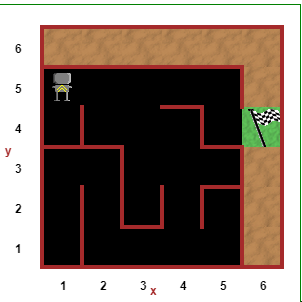

# Day 6: Python Functions & Karel

## Escape The Maze
- https://reeborg.ca/reeborg.html?lang=en&mode=python&menu=worlds%2Fmenus%2Freeborg_intro_en.json&name=Maze&url=worlds%2Ftutorial_en%2Fmaze1.json

Code:

```python

"""hug the right side of the wall
if nothing in front go right, if nothing in front
again then keep hugging the right side of the wall"""
def turn_right():
    turn_left()
    turn_left()
    turn_left()

while front_is_clear():
    move()
turn_left()
    
    
while not at_goal():
    if right_is_clear():
        turn_right()
        move()
    elif front_is_clear():
        move()
    else:
        turn_left()

```

## Showcase



